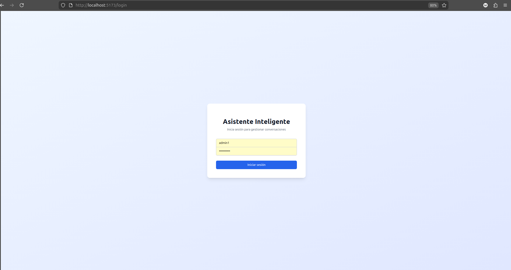
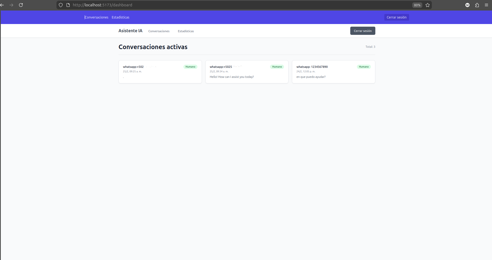
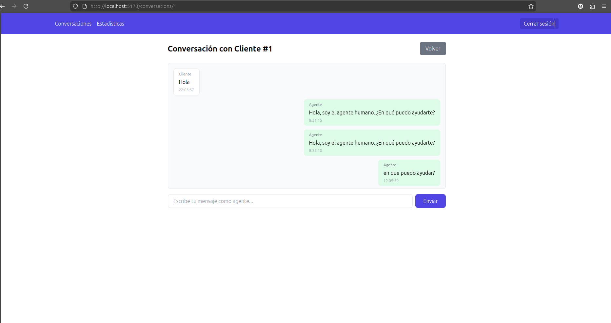

# Asistente Inteligente Multicanal
[](https://fastapi.tiangolo.com)
[](https://reactjs.org/)
[](https://tailwindcss.com/)
[](https://www.twilio.com/)
[](https://openai.com/)

Sistema de atención al cliente automatizado vía WhatsApp y web, con inteligencia artificial y derivación a humano. Permite gestionar conversaciones desde un panel administrativo en tiempo real.
## 📸 Capturas de pantalla

*Login* | *Dashboard* | *Conversación*
---|---|---|
 |  | 
## ✨ Características

- 🤖 Integración con OpenAI GPT para respuestas inteligentes
- 📱 Canal de WhatsApp mediante Twilio (sandbox o producción)
- 🔀 Derivación automática a agente humano por palabras clave
- 💬 Panel administrativo en tiempo real con WebSockets
- 📊 Estadísticas básicas de uso
- 🔐 Autenticación JWT para agentes
- 🐳 Desarrollo con Docker y docker-compose
- ✅ Pruebas automatizadas con pytest

## 🛠 Tecnologías

- **Backend**: FastAPI, SQLAlchemy, Celery, Redis, PostgreSQL
- **Frontend**: React, TailwindCSS, Socket.IO-client, Vite
- **Servicios externos**: Twilio (WhatsApp), OpenAI API
- **DevOps**: Docker, Docker Compose, GitHub Actions (CI/CD)

## 🚀 Instalación y ejecución local

### Prerrequisitos

- Docker y Docker Compose
- Node.js 18+ (para desarrollo frontend, opcional si usas Docker)
- Cuentas en Twilio y OpenAI (con créditos)

### Pasos

1. Clonar el repositorio:
   ```bash
   git clone https://github.com/tu-usuario/asistente-inteligente-multicanal.git
   cd asistente-inteligente-multicanal
2. cp .env.example .env
# Editar .env con tus credenciales de Twilio, OpenAI, etc.
3. Levantar los servicios con Docker: docker-compose up -d
4. Ejecutar migraciones de base de datos: docker-compose exec backend alembic upgrade head
5. Instalar dependencias del frontend y ejecutarlo:
    cd frontend
    npm install
    npm run dev
6. Acceder a:
    API: http://localhost:8000/docs

    Frontend: http://localhost:5173

Uso con ngrok (para webhook de Twilio)
ngrok http 8000

Configurar la URL en la consola de Twilio como webhook para WhatsApp.
📦 Despliegue en producción (Render)

Ver GUIA_DESPLIEGUE.md
🧪 Pruebas
# Backend
docker-compose exec backend pytest

# Frontend (si configuraste)
cd frontend && npm run test

📄 Licencia

MIT
👤 Autor

Tu Nombre - @ma_odas - maodas00@gmail.com o rodas807@gmail.com
